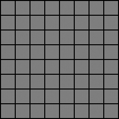
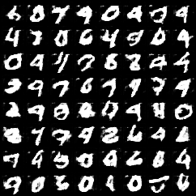
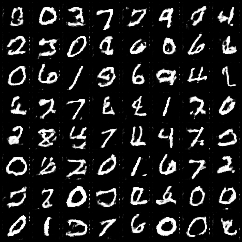
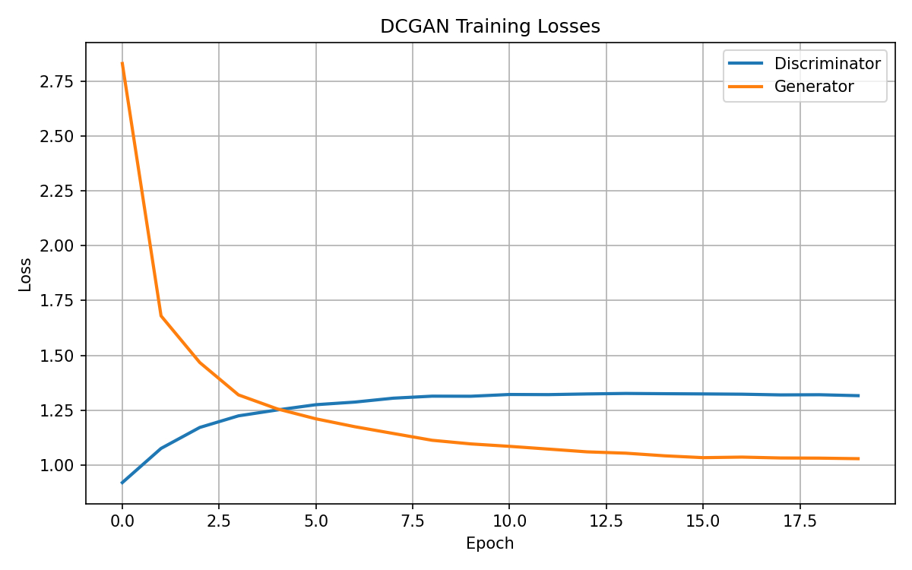
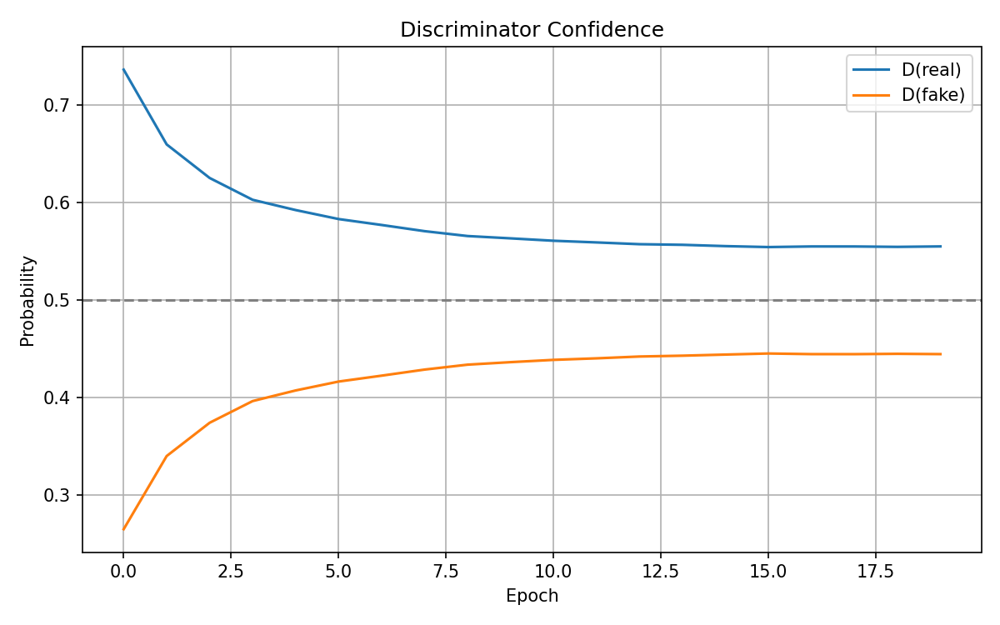

# DCGAN from Scratch

From-scratch PyTorch implementation of a Deep Convolutional GAN (DCGAN) on MNIST dataset,
with detailed logging, diagnostics, and reproducible training.

## Features
- "Correct" DCGAN architecture
- Stable training with BCEWithLogitsLoss
- Fixed-latent visualization
- Loss and discriminator confidence plots
- Reproducible experiments (seeded)

## Dataset
- MNIST (28×28)

## Generated Samples

Samples generated from a fixed latent vector during training:

## Training Curves

### GAN Losses

### Discriminator confidence

## Notes
GAN losses do not directly correlate with image quality.
Training progress is assessed primarily via fixed-latent image grids.